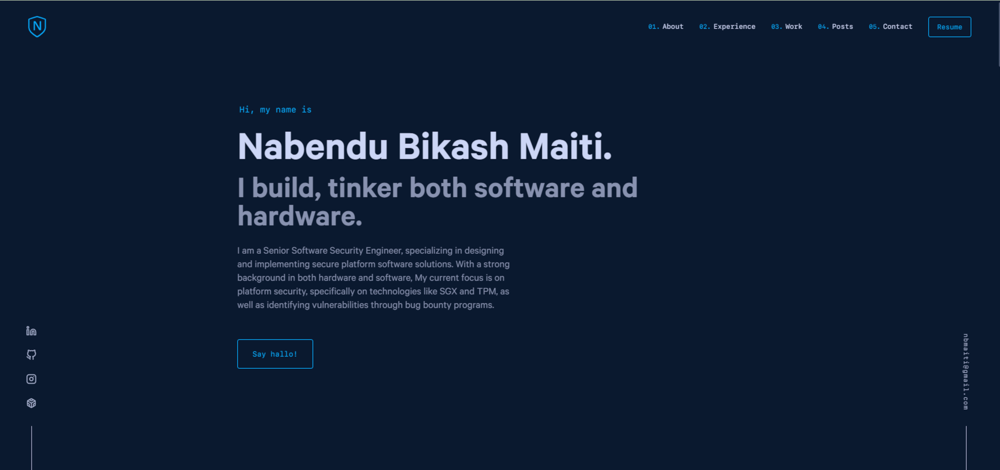
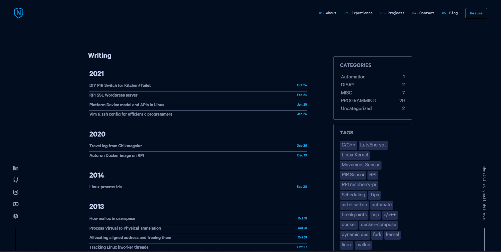

# Nabendu Maiti - Portfolio & Blog


<div align="center">
  
</div>
<h1 align="center">
  nabendumaiti.com - v2
</h1>
<p align="center">
  Iteration of  my personal site built with <a href="https://www.gatsbyjs.org/" target="_blank">NextJs</a> and hosted with love from <a href="https://www.netlify.com/" target="_blank">Netlify</a>
</p>

<p align="center">

<a href="https://opensource.org/licenses/MIT">
    
</a>
  <a href="https://app.netlify.com/sites/nabendumaiti/deploys" target="_blank">
    
  </a>
</p>

This is the source code for Nabendu Maiti's personal portfolio and blog, built with Next.js. The project was originally migrated from Gatsby and leverages the Next.js App Router for improved performance and structure.

This project is inspired by the work of [Brittany Chiang](https://github.com/bchiang7/v4) and  [Tania Rascia](https://github.com/taniarascia/taniarascia.com)

## Demo





## Features

-   **Next.js App Router**: Utilizes the latest Next.js features for routing, layouts, and server/client components.
-   **Static Site Generation (SSG)**: Pre-renders over 90 pages for optimal performance, including posts, tags, and category pages.
-   **Content from Markdown**: All content (blog posts, projects, job history) is managed in local Markdown files.
-   **API Routes**: Custom API routes for serving images and other content.
-   **Styled Components**: Used for all styling, with support for server components.
-   **Dark Mode**: Theme support for light and dark modes.
-   **Comments**: Giscus integration for comments on blog posts.

## Tech Stack

| Technology          | Version | Description                              |
| ------------------- | ------- | ---------------------------------------- |
| **Next.js**         | 16.1.1  | The React framework for production.      |
| **React**           | 19.2.3  | A JavaScript library for building UIs.   |
| **Styled Components** | 6.1.8   | For styling React components.            |
| **Remark/Rehype**   | 15/11   | For parsing and transforming Markdown.   |
| **gray-matter**     | 4.0.3   | To parse frontmatter from Markdown.      |
| **giscus**          | 3.1.0   | For comments.                            |

## Color Palette

The site supports both light and dark themes with the following color palette:
| Theme      | Dark Navy | Navy     | Light Navy | Lightest Navy | Slate    | Light Slate | Lightest Slate | White    | Highlight      | Highlight Tint         |
|------------|-----------|----------|------------|---------------|----------|-------------|----------------|----------|----------------|------------------------|
| **Dark**   |  |  |  |  |  |  |  |  |  |  |
| **Light**  |   |  |  |  |  |  |  |  |  |  |  |  |

## Getting Started


### Prerequisites

-   Node.js (LTS version recommended, e.g., 20.x +)
-   `yarn` or `npm`

### Dev Installation & Running 
>[📦 Component Structure](./COMPONENT_STRUCTURE.md)

1.  **Clone the repository:**
    ```bash
    git clone https://github.com/nmaiti/nabendumaiti.git
    ```

2.  **Install dependencies:**
    Using `yarn` (preferred):
    ```bash
    yarn
    ```
    Or with `npm`:
    ```bash
    npm install
    ```
    > ***Important Note:*** To use your own content (I have my own private repo linked here)
    > ```bash
    > git submodule set-url content <your-content-url>
    > git submodule sync && git submodule update --remote <submodule-path>
    > ```
    > Or to just test this repo  run commands to use example content 
    > ```bash
    > rm -rf content && mv content_test content
    ```

3.  **Run the development server:**
    Using `yarn`:
    ```bash
    yarn dev
    ```
    Or with `npm`:
    ```bash
    npm run dev
    ```

4.  **Open in browser:**
    Open [http://localhost:3000](http://localhost:3000) with your browser to see the result.

  
### Production Deployment (locally/cloud)

1. **Build the application:**
    ```bash
    yarn build
    ```
2. **Start the production server:**
    ```bash
    yarn start
    ```


This project is configured for easy deployment on both Vercel and Netlify.

#### Vercel

The project can be deployed to Vercel with zero configuration. Connect your Git repository to Vercel and it will be deployed automatically. You can also deploy manually using the Vercel CLI:
```bash
vercel --prod
```

#### Netlify

The `netlify.toml` file is configured for deployment on Netlify. You can also deploy manually using the Netlify CLI:
```bash
netlify deploy --prod
```

## License

This project is licensed under the MIT License - see the [LICENSE](LICENSE) file for details.
